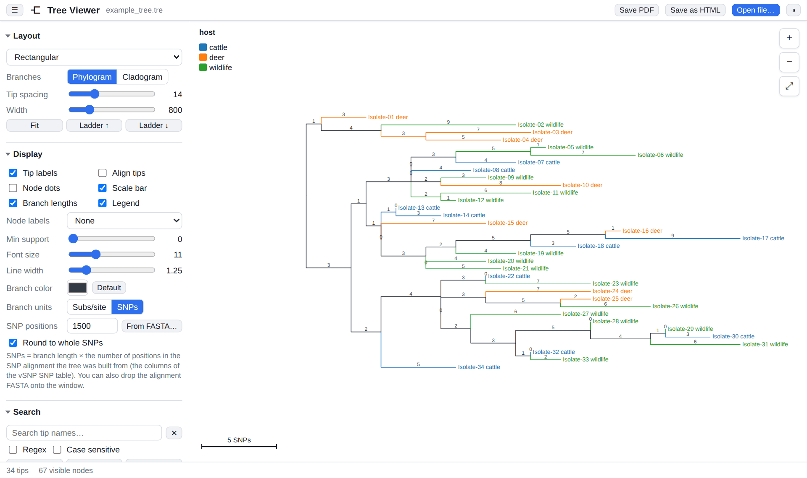
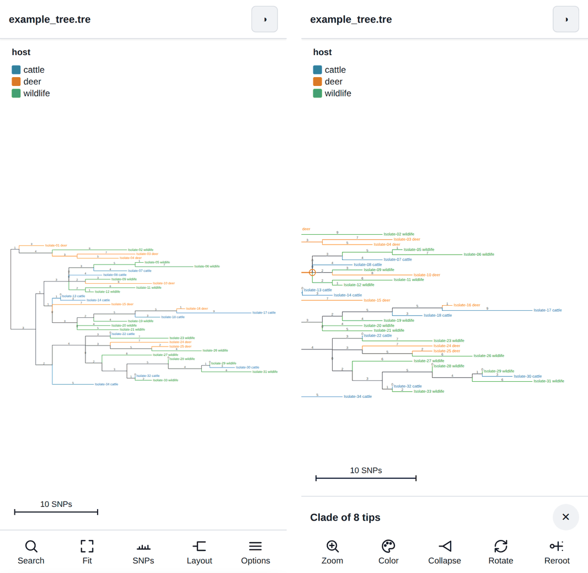

# Phylogenetic Tree HTML Viewer

View, explore and share phylogenetic trees in your web browser. Nothing to install, and your data never leaves your computer.

**Open the viewer: https://YOUR-NAME.github.io/phylogenetic-tree-html-viewer/**

Built for everyday work with SNP trees, such as those from vSNP: reroot, color clades, show branch lengths as SNP counts, and send the result to colleagues as a file, a PDF or a link.

> [!IMPORTANT]
> **Your data stays with you.** Trees and tables you open are read by your own browser. They are not uploaded anywhere, and the page is technically blocked from sending data over the internet.

---

## Quick start

1. **Open a tree.** Click **Open file…** or drag a tree file onto the page. To try it first, click **Load example tree**.
2. **Explore.** Scroll to zoom, drag to move around, and click a branch to select that clade.
3. **Share.** Click **Save PDF**, **Save as HTML**, or **Copy share link** (under *Export* in the side panel).

Supported files: Newick (`.tre`, `.nwk`, `.newick`, `.tree`, `.treefile`, `.contree`) and NEXUS (`.nex`, `.nexus`). If a file holds several trees, choose one from the menu at the top.

---

## What you can do

| Task | How |
|---|---|
| **Change the layout** | *Layout*: rectangular, slanted, circular, fan or unrooted radial. Use *Cladogram* to ignore branch lengths. |
| **Reroot** | Select a branch, then *Rooting* → **Reroot on branch**. Also: **Midpoint root**, **Outgroup root**, or turn on **Reroot mode** and click any branch. **Undo** steps back. |
| **Color clades** | Select a clade, pick a color, click **Color clade**. |
| **Color by metadata** | *Color by metadata* → **Load CSV / TSV…**. The first column must hold tip names; choose any other column to color by. A legend is added automatically. |
| **Find samples** | Type in *Search*. Matches are highlighted; **Zoom** jumps to them. |
| **Tidy the tree** | **Ladder ↑ / ↓** sorts clades by size. Double-click a node to collapse or expand it. |
| **Show values** | *Display*: branch lengths, support values, node dots, aligned tip labels. |

**Selecting:** click a tip or branch. Shift-click adds to the selection; Shift-drag draws a box.

**Keyboard:** <kbd>F</kbd> fit to window · <kbd>R</kbd> rotate node · <kbd>C</kbd> collapse · <kbd>Z</kbd> undo · <kbd>Esc</kbd> clear selection · <kbd>/</kbd> search

---

## Branch lengths as SNPs

Tree files store branch lengths as *substitutions per site*. To see SNP counts instead:

1. In *Display*, set **Branch units** to **SNPs**.
2. Enter the number of **SNP positions**, meaning the number of columns in your SNP table. Or click **From FASTA…** and choose the SNP alignment the tree was built from; the viewer counts the positions for you.

The scale bar, branch labels and pop-up details then read in SNPs.

> [!NOTE]
> SNPs = branch length × number of SNP positions. The tree program estimates branch lengths with a model, so the numbers are close to, but not always identical to, the differences you would count in the SNP table.

---

## Sharing your tree

All three options keep your colors, rerooting, collapsed clades, metadata and settings.

| Option | Best for | Computer | Android | iPhone |
|---|---|:---:|:---:|:---:|
| **Copy share link** | Quick sharing by email or chat | ✅ | ✅ | ✅ |
| **Save as HTML** | A file to keep or attach | ✅ | ✅ | Picture + "Open interactive tree" button |
| **Save PDF** | Reports, printing, viewing anywhere | ✅ | ✅ | ✅ |

- **Share link:** the whole tree travels inside the link. Recipients get the full interactive viewer, even on iPhone.
- **HTML file:** opens fully interactive in any browser on a computer, and in Chrome on Android. iPhones can't run web pages saved as files, so they show a still picture with a button that opens the interactive version.
- **PDF:** a sharp picture of the whole tree that zooms cleanly. Choose the page size under *Export* → *PDF page*: *Sized to the tree* (best on screens), or *Letter* / *A4* for printing.

Also under *Export*: **SVG** and **PNG** images for figures, and **Newick** to save the rerooted tree.

> [!CAUTION]
> Links, saved HTML files and PDFs **contain your tree**. Anyone you send them to can see the sample names. Share them the way you would share the tree file itself.

---

## On a phone

The viewer adapts to small screens:

- **Toolbar** at the bottom: Search, Fit, SNPs/Subs, Layout and Options.
- **Pinch** to zoom and **drag** to move.
- **Tap a branch** to select a clade. The toolbar switches to Zoom, Color, Collapse, Rotate and Reroot.
- **Tap a tip** to see its details.
- **Options** opens every setting, plus Open file, Save PDF, Save HTML and Share link.

---

## Common questions

**My sample names show spaces instead of underscores.**
That's standard Newick behavior. Metadata still matches whether your table uses spaces or underscores.

**Someone on an iPhone only sees a picture.**
Email and chat apps on iPhone can't run interactive HTML files. Send a **share link** instead, or a **PDF**.

**A share link won't open, or says the tree couldn't be read.**
Some chat apps cut off very long links (large trees). Send the HTML file or PDF instead.

**Can I use it offline?**
Yes. Save this page (`index.html`) to your computer and open it in your browser. Everything works without internet.

---

## For the page maintainer

<b>Publishing and safety checks</b>

### Setting up the page

1. Create a public repository named `phylogenetic-tree-html-viewer`.
2. Upload `index.html`, `README.md`, `viewer-desktop.png` and `viewer-phone.png` (**Add file → Upload files**).
3. Add the two safety files with **Add file → Create new file**, pasting in their contents: name one `.gitignore`, and the other `.github/workflows/publish.yml` (typing the slashes creates the folders).
4. Go to **Settings → Pages → Build and deployment**, and set **Source** to **GitHub Actions**.
5. Your page appears at `https://YOUR-NAME.github.io/phylogenetic-tree-html-viewer/` within a minute or two. Replace `YOUR-NAME` at the top of this README with your GitHub username.

**Optional:** in `index.html`, set `VIEWER_URL_DEFAULT` to your page's address. HTML files saved from downloaded copies of the viewer will then also get the "Open interactive tree" button.

### Built-in safeguards against publishing data

- **The viewer holds no data.** `index.html` is a blank tool. Trees are only ever opened in a visitor's own browser.
- **Privacy lock.** A Content-Security-Policy in `index.html` blocks the page from loading outside code or sending anything over the network.
- **Allow-list `.gitignore`.** When using GitHub Desktop or git on your computer, only the files listed above can be added. Trees, tables, alignments, PDFs and saved tree pages are ignored.
- **Check on every change.** The workflow rejects any file that isn't on the list, any HTML file with a saved tree inside it, and any `index.html` missing the privacy lock. If a check fails, nothing is published and GitHub emails you.
- **Only `index.html` is published.** Even if something else lands in the repository, the website serves the viewer alone.
- **Warning banner.** If a saved tree file is ever opened from a website, the page shows a red warning.

**The one rule:** never upload files made with *Save as HTML* (`*_tree.html`), tree files, SNP tables or screenshots of real data. For README pictures, use the example tree or invented names.

### If data is ever pushed by mistake

The repository is public, so a pushed file is visible even if the website never shows it. Make the repository private right away (**Settings → General → Danger Zone**), delete the file, and follow GitHub's guide [Removing sensitive data from a repository](https://docs.github.com/en/authentication/keeping-your-account-and-data-secure/removing-sensitive-data-from-a-repository). Deleting a file alone does not remove it from history.

